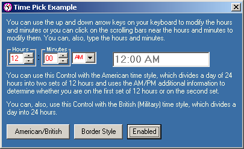



## Time Pick ActiveX Control

### Description

This ActiveX Control (OCX) will create a simple interface so the user can enter a determined time. It then validates the time entered and will always return a correct time.

This control can be very useful if you are writing a program like an Alarm Clock or something like this.

It can be, also, very instructive for those who want to learn how to program an ActiveX Control.
 
### More Info
 

             |
---                |---
**Submitted On**   |2002-02-26 18:08:38
**By**             |[Elias Barbosa](https://github.com/Planet-Source-Code/PSCIndex/blob/master/ByAuthor/elias-barbosa.md)
**Level**          |Intermediate
**User Rating**    |4.6 (37 globes from 8 users)
**Compatibility**  |VB 6\.0
**Category**       |[Custom Controls/ Forms/  Menus](https://github.com/Planet-Source-Code/PSCIndex/blob/master/ByCategory/custom-controls-forms-menus__1-4.md)
**World**          |[Visual Basic](https://github.com/Planet-Source-Code/PSCIndex/blob/master/ByWorld/visual-basic.md)
**Archive File**   |[Time\_Pick\_578682262002\.zip](https://github.com/Planet-Source-Code/elias-barbosa-time-pick-activex-control__1-32133/archive/master.zip)

